# Mermaid 详细语法速查

## 一、图类型与方向

**代码块格式**：以 ` ```mermaid ` 开头，` ``` ` 结尾。

| 关键字 | 图类型 |
| :--- | :--- |
| `graph` / `flowchart` | 流程图 |
| `sequenceDiagram` | 时序图 |
| `classDiagram` | 类图 |
| `stateDiagram-v2` | 状态图（推荐） |
| `erDiagram` | ER 图 |
| `gantt` | 甘特图 |
| `pie` | 饼图 |
| `gitGraph` | Git 图 |
| `mindmap` | 思维导图 |
| `timeline` | 时间线 |
| `quadrantChart` | 四象限图 |
| `xychart-beta` | 折线/柱状图 |

**流程图方向**：`TD`/`TB` 上到下、`BT` 下到上、`LR` 左到右、`RL` 右到左。

**类图方向**：在类图内写 `direction RL` 等设置渲染方向。

---

## 二、流程图

### 节点形状

| 写法 | 效果 |
| :--- | :--- |
| `A[文本]` | 矩形 |
| `A(文本)` | 圆角矩形 |
| `A((文本))` | 圆形 |
| `A{文本}` | 菱形 |
| `A{{文本}}` | 六边形 |
| `A[(文本)]` | 数据库/圆柱 |
| `A[[文本]]` | 子程序 |
| `A[/文本/]` | 平行四边形 |
| `A[\文本\]` | 反向平行四边形 |
| `A>文本]` | 非对称 |

### 连线类型

| 写法 | 效果 |
| :--- | :--- |
| `A --> B` | 实线箭头 |
| `A --- B` | 实线无箭头 |
| `A -.-> B` | 虚线箭头 |
| `A ==> B` | 粗线箭头 |
| `A -- 文本 --> B` | 实线带文字 |
| `A -->\|文本\| B` | 箭头带文字 |
| `A <--> B` | 双向箭头 |
| `A o--o B` | 圆点两端 |
| `A x--x B` | 叉号两端 |

**链路长度**：增加破折号可让连线跨更多层级。`A ----> B` 比普通连线多跨两层。

| 长度 | 1 | 2 | 3 |
| :--- | :--- | :--- | :--- |
| 普通 | `---` | `----` | `-----` |
| 普通+箭头 | `-->` | `--->` | `---->` |
| 粗线 | `===` | `====` | `=====` |
| 虚线 | `-.-` | `-..-` | `-...-` |

### 特殊字符处理

节点文本含括号、引号等特殊字符时，用引号包裹：`id1["This is (text) in the box"]`。

### 样式

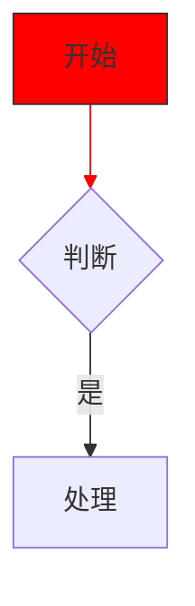

**边 ID 与动画**（较新版本）：

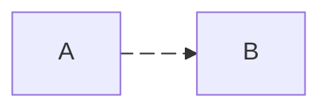

---

## 三、时序图

### 参与者与消息

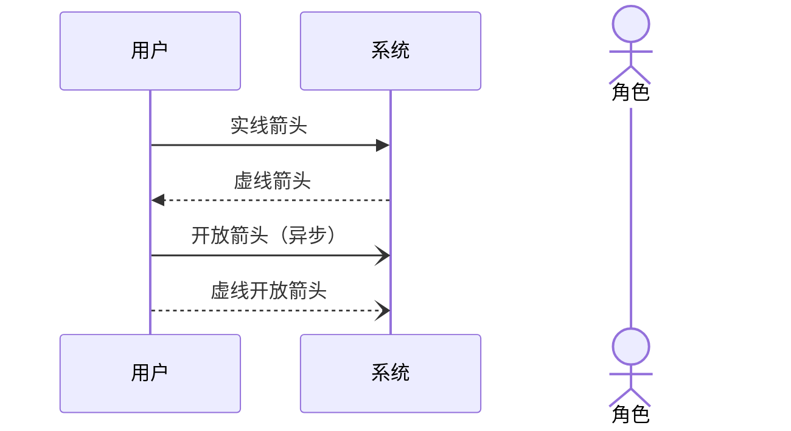

| 写法 | 说明 |
| :--- | :--- |
| `->>` | 实线箭头 |
| `-->>` | 虚线箭头 |
| `-)` | 实线开放箭头（异步） |
| `--)` | 虚线开放箭头（异步） |
| `->` | 无箭头实线 |
| `-->` | 无箭头虚线 |

**半箭头**（v11.12.3+）：`-|\`、`-|/`、`/|-` 等多种方向。

### 注释与激活

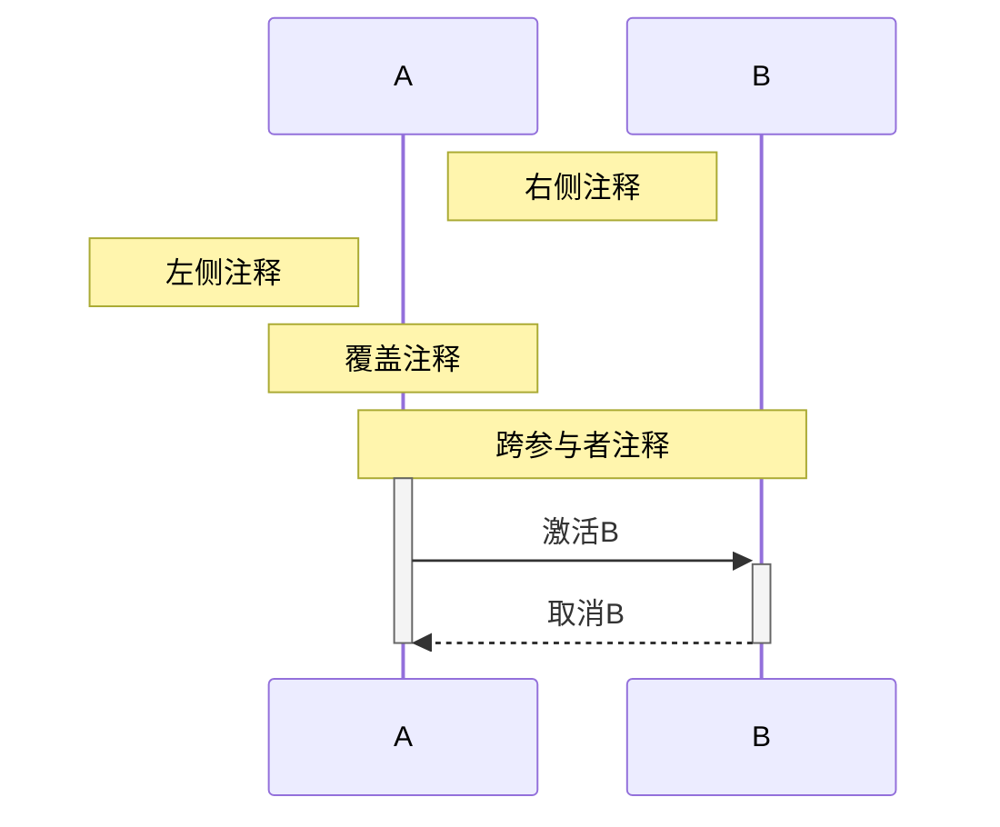

- `Note right of/left of/over 参与者: 文本`
- 换行用 `<br/>`
- `activate`/`deactivate` 或消息箭头后加 `+`/`-` 快捷激活

### 控制流

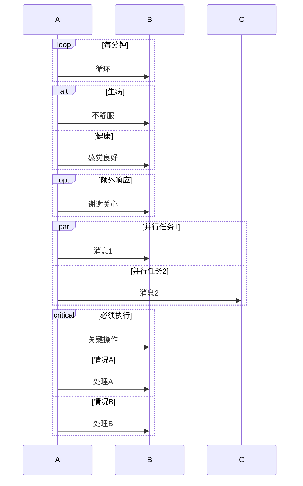

| 块 | 说明 |
| :--- | :--- |
| `loop ... end` | 循环 |
| `alt ... else ... end` | 分支 |
| `opt ... end` | 可选 |
| `par ... and ... end` | 并行 |
| `critical ... option ... end` | 关键区域 |

### 其他功能

| 写法 | 说明 |
| :--- | :--- |
| `rect rgb(0,0,0)` | 背景高亮 |
| `autonumber` | 自动编号 |
| `box 颜色` | 分组参与者 |
| `break` | 中断流程 |

---

## 四、类图

### 类定义

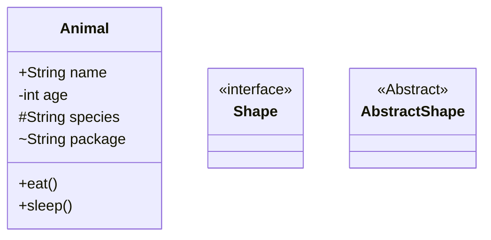

| 标记 | 含义 |
| :--- | :--- |
| `+` | public |
| `-` | private |
| `#` | protected |
| `~` | package |
| `<<Interface>>` | 接口 |
| `<<Abstract>>` | 抽象类 |
| `<<Enumeration>>` | 枚举 |

### 关系类型

| 写法 | 含义 |
| :--- | :--- |
| `A <\|-- B` | B 继承 A |
| `A *-- B` | 组合 |
| `A o-- B` | 聚合 |
| `A --> B` | 关联 |
| `A ..> B` | 依赖 |
| `A ..\|> B` | 实现 |

### 基数标注

在关系两端用引号标注：

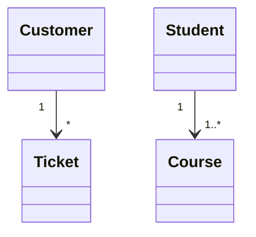

可用基数：`1`、`0..1`、`1..*`、`*`、`n`、`0..n`、`1..n`。

### 命名空间

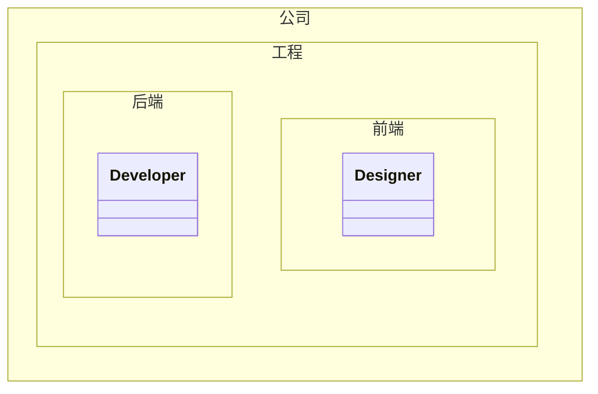

支持嵌套命名空间和点号自动创建父级。

### 方向与注释

- `direction RL` 等设置方向。
- `%% 这是注释` 单独一行。

---

## 五、状态图

**推荐使用 `stateDiagram-v2`。**

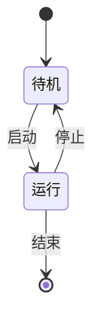

### 状态定义

| 写法 | 说明 |
| :--- | :--- |
| `stateId` | 简单状态 |
| `state "描述" as s2` | 带描述 |
| `s2 : 描述` | 冒号方式 |
| `state 名称 { ... }` | 复合状态 |

### 特殊状态

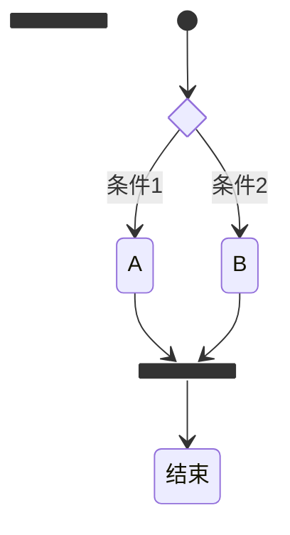

### 并发与注释

- `--` 分隔并发区域。
- `note right of 状态: 文本` 添加注释。

---

## 六、ER 图

### 关系基数（乌鸦脚标记）

| 左侧 | 右侧 | 含义 |
| :--- | :--- | :--- |
| `\|\|` | `\|\|` | 恰好一个 |
| `\|o` | `o\|` | 零或一个 |
| `}o` | `o{` | 零或多个 |
| `}\|` | `\|{` | 一个或多个 |

**实线 `--`** = 标识关系；**虚线 `..`** = 非标识关系。

### 实体与属性

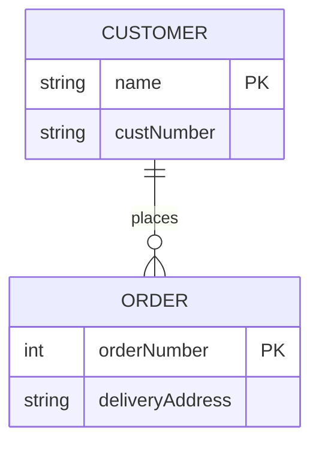

| 标记 | 含义 |
| :--- | :--- |
| `PK` | 主键 |
| `FK` | 外键 |
| `UK` | 唯一键 |
| `string?` | 可选类型（v11.16.0+） |

**别名**：`p[Person]` 或 `a["Customer Account"]`。

**方向**：`direction TB` / `BT`。

---

## 七、甘特图

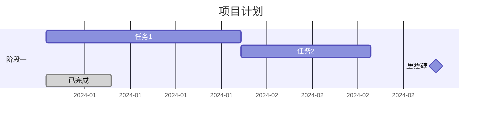

| 写法 | 说明 |
| :--- | :--- |
| `title` | 标题 |
| `dateFormat` | 输入日期格式，默认 `YYYY-MM-DD` |
| `axisFormat` | 输出轴格式，如 `%Y-%m-%d` |
| `section` | 分组 |
| `任务 :id, 开始, 时长` | 任务定义 |
| `after a1` | 依赖关系 |
| `milestone` | 里程碑 |
| `done` / `active` / `crit` | 完成/进行/关键 |

**日期格式**：`YYYY` 年、`MM` 月、`DD` 日、`Q` 季度、`X` Unix 时间戳等。

---

## 八、饼图

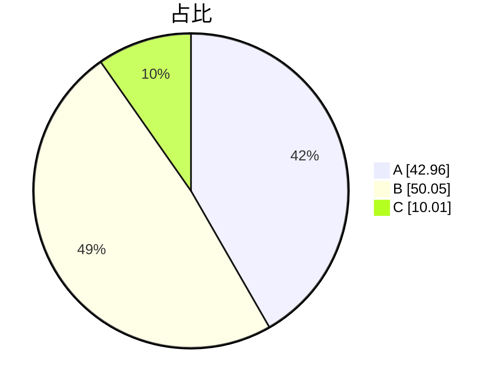

- `showData`：在标签后显示数值（可选）
- 数据值必须为正数。
- 饼片按标签顺序顺时针排列。

**配置参数**（v11.16.0+）：

| 参数 | 说明 | 默认 |
| :--- | :--- | :--- |
| `textPosition` | 标签径向位置，0~1 | 0.75 |
| `donutHole` | 环形图孔洞比例，0~0.9 | 0 |
| `legendPosition` | 图例位置 | right |
| `highlightSlice` | 高亮特定切片 | — |

---

## 九、Git 图

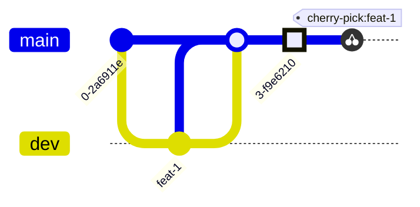

| 写法 | 说明 |
| :--- | :--- |
| `commit` | 提交 |
| `commit id: "说明"` | 带 ID |
| `commit type: HIGHLIGHT` | 类型：NORMAL/HIGHLIGHT/REVERSE |
| `branch 名称` | 创建分支 |
| `checkout 名称` | 切换 |
| `merge 名称` | 合并 |
| `cherry-pick id: "..."` | 摘取，需指定已存在 ID |

**配置**：`showBranches`、`showCommitLabel`、`mainBranchName`、`parallelCommits`。

---

## 十、其他图类型

### 思维导图

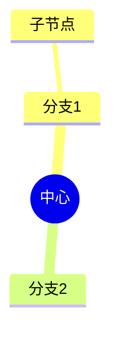

形状：`((圆形))`、`[方形]`、`)云形(`、`))爆炸形((`

### 时间线

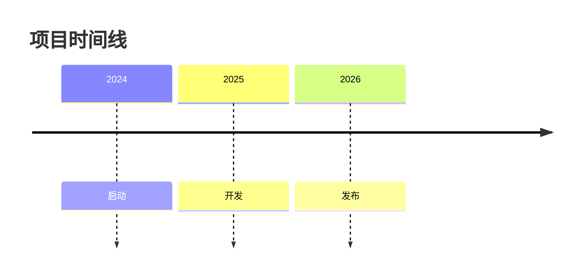

### 四象限图

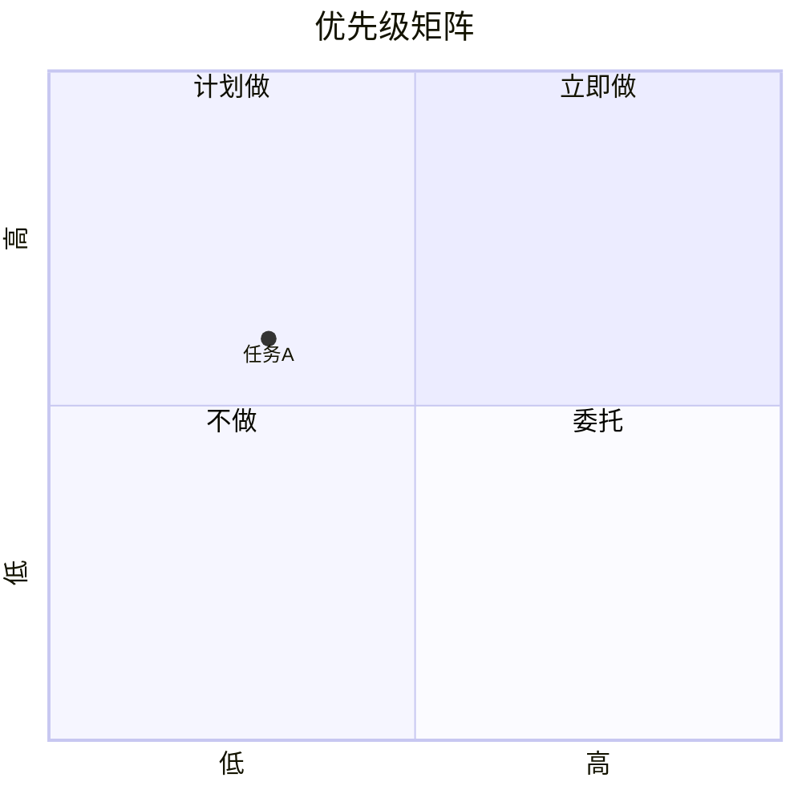

### XY 图

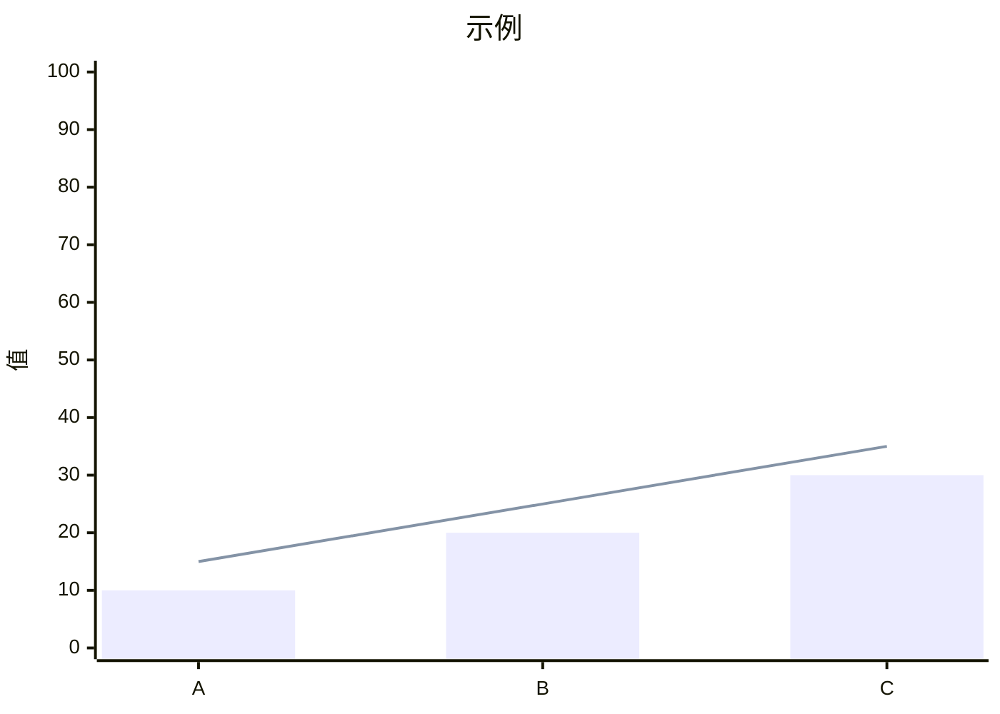

---

## 十一、通用技巧

### 注释与配置

| 写法 | 说明 |
| :--- | :--- |
| `%% 注释` | 单独一行 |
| `%%{init: {"theme": "dark"}}%%` | 全局主题 |
| `%%{init: {"flowchart": {"curve": "basis"}}}%%` | 图类型专属配置 |

**主题**：`default`、`neutral`、`dark`、`forest`、`base`。

### 转义与特殊字符

| 字符 | 写法 |
| :--- | :--- |
| `"` | `#quot;` |
| `#` | `#35;` |
| `<` | `#lt;` |
| `>` | `#gt;` |
| `&` | `#amp;` |
| `\` | `#92;` |

节点文本含特殊字符时优先用双引号包裹。

### 踩坑提醒

- 子图必须以 `end` 结束
- 类图 `A <|-- B` 表示 B 继承 A，方向别写反
- 状态图优先 `stateDiagram-v2`
- 甘特图日期格式需与 `dateFormat` 一致
- 不同渲染器支持的图类型和版本不同，用前确认
<!--stackedit_data:
eyJoaXN0b3J5IjpbMjAwNzg0MzQ4MF19
-->