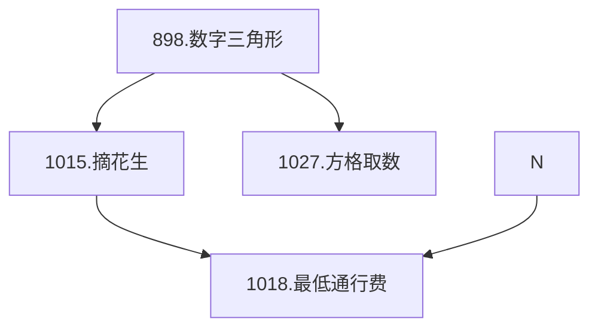

### 数字三角形模型

---

**概念**：由数字三角形可以拓展出许多的题目，关于数字三角形，详见[6.2 线性 DP](https://cuberxl.github.io/Coders-Note/6-动态规划/6.2-线性DP) 。
**问题一：摘花生问题**
	- 问题：[Acwing 1015. 摘花生](https://www.acwing.com/problem/content/1017/)
	- 
<!--stackedit_data:
eyJoaXN0b3J5IjpbLTQzODIxNTc4MiwtMzgwOTg5ODk3LDE4ND
QzMDcyNzYsNDQwOTA1NjE5XX0=
-->