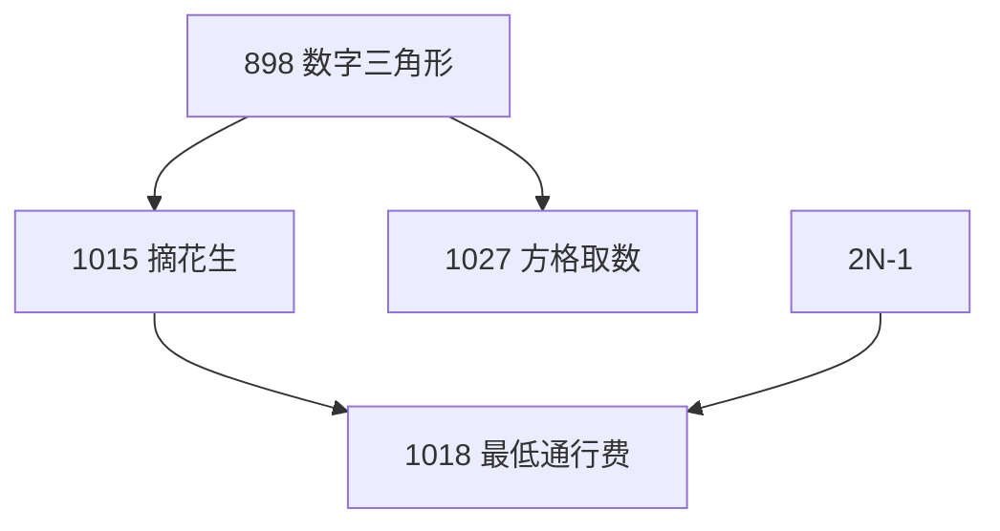

### 数字三角形模型

---
**本章结构**：

**概念**：由数字三角形可以拓展出许多的题目，关于数字三角形，详见[6.2 线性 DP](https://cuberxl.github.io/Coders-Note/6-动态规划/6.2-线性DP) 。

**问题一：摘花生问题**
- 问题：[Acwing 1015. 摘花生](https://www.acwing.com/problem/content/1017/)
- 状态表示：$f[i][j]$ 表示所有从 $(1,1)$走到$(i,j)$的路线。
- 属性：$max$
- 集合划分：依照转移方向来划分。
	- 从上方转移：$f[i][j]=f[i-1][j]+a[i][j]$
	- 从左方转移：$f[i][j]=f[i-1][j]+a[i][j]$

**问题二：最低通行费**
- 问题：[Acwing 1018. 最低通行费](https://www.acwing.com/problem/content/1020/)
- 分析：观察题目性质，从左上至右下至少走 $2n-1$ 个格子。故本题不存在回头路的情况，可依照摘花生问题解决。
- 边界：$f[1][0]=f[0][1]=0,f[i][j]=INF$

**问题三：方格取数**
- 问题：[Acwing 1027. 方格取数](https://www.acwing.com/problem/content/1029/)
- 状态表示1：$f[i_1][j_2][i_2][j_2]$ 表示所有从 $(1,1)$走到$(i_1,j_1)$和$(i_2,j_2)$的路线。
- 属性：$max$
- 集合划分：依照转移方向来划分。
	- 从上方转移：$f[i][j]=f[i-1][j]+a[i][j]$
	- 从左方转移：$f[i][j]=f[i-1][j]+a[i][j]$

<!--stackedit_data:
eyJoaXN0b3J5IjpbLTE3MDYzMjgxNDAsMTc5NTA3NDQsLTU0MD
Y0OTMzMiwtNTE2MjYzOTkyLC00MzgyMTU3ODIsLTM4MDk4OTg5
NywxODQ0MzA3Mjc2LDQ0MDkwNTYxOV19
-->