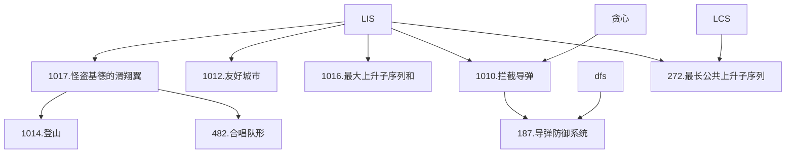

### 最长上升子序列模型（LIS）

---

**本章结构**：

**一、怪盗基德的滑翔翼**
- 问题：[Acwing 1017.怪盗基德的滑翔翼](https://www.acwing.com/problem/content/1019/)
- 分析：分别求 $1 \sim i$，$n \sim i$ 的 LIS 即可。

**一、怪盗基德的滑翔翼**
- 问题：[Acwing 1017.怪盗基德的滑翔翼](https://www.acwing.com/problem/content/1019/)
- 分析：分别求 $1 \sim i$，$n \sim i$ 的 LIS 即可。
<!--stackedit_data:
eyJoaXN0b3J5IjpbLTE1MjA0OTI5MzAsLTE1MzE0MDk3NjQsLT
k0NTEwOTc3MSwtMTY3NzU5MjY5MiwtMTU4OTg4NTgzNV19
-->