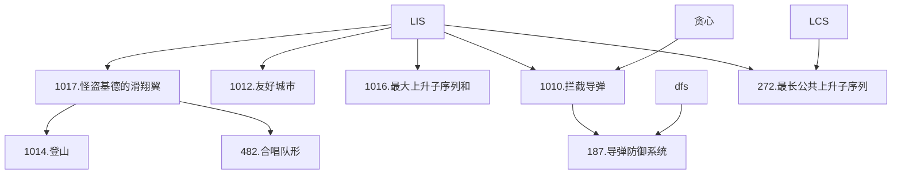

### 最长上升子序列模型（LIS）

---
**本章结构**：

**概念**：由LIS可以拓展出许多的题目，关于LIS，详见[6.2 线性 DP](https://cuberxl.github.io/Coders-Note/6-动态规划/6.2-线性DP) 。

**一、怪盗基德的滑翔翼**
- 问题：[Acwing 1017.怪盗基德的滑翔翼](https://www.acwing.com/problem/content/1019/)
- 分析：分别求 $1 \sim i$，$n \sim i$ 的 LIS 即可。

**二、登山**
- 问题：[Acwing 1014.登山](https://www.acwing.com/problem/content/1016/)
- 分析：编号递增 $\Leftrightarrow$ 子序列，一旦开始下降不可上升 $\Leftrightarrow$ 单峰，分别求 $1 \sim i$ 的 LIS  $f[i]$ ，$n \sim i$ 的 LIS $g[i]$ ，$ans=\max(f[i]+g[i])$。

**三、合唱队形**
- 问题：[482.合唱队形](https://www.acwing.com/problem/content/484/)
- 分析：分析题目条件，同上题，输出 $ans-n$ 即可。

**四、友好城市**
- 问题：[1012.友好城市](https://www.acwing.com/problem/content/1014/)
- 分析：两条航线相交当且仅当 $i_1<i_2 \land j_1>j_2$
可将 $i$ 作为第一关键字排序，求解 $j$ 的LIS 即可

**五、最大上升子序列和**
- 问题：[1016.最大上升子序列和](https://www.acwing.com/problem/content/1018/)
- 分析：
	- 状态表示：$f[i]$ 表示以第 $i$ 个数结尾的最长上升子序列和。
	- 状态转移：当$a[j]<a[i]$ 时，$f[i] = \max(f[i],f[j]+1)$
<!--stackedit_data:
eyJoaXN0b3J5IjpbMTk1NzQ5MTU1NiwtMTcxNzYxNDQxMSwtMT
kxMzAyNTcwLC0xNTIwNDkyOTMwLC0xNTMxNDA5NzY0LC05NDUx
MDk3NzEsLTE2Nzc1OTI2OTIsLTE1ODk4ODU4MzVdfQ==
-->