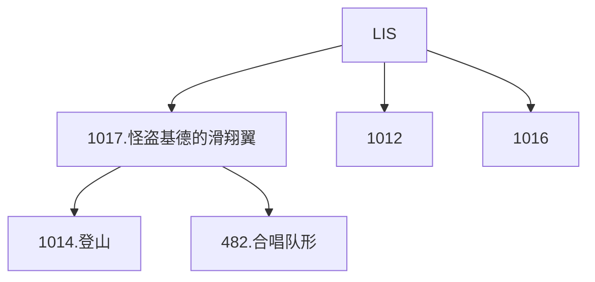

### 最长上升子序列模型（LIS）

---

**本章结构**：

```mermaid
graph TD
A[LIS]-->B[1017.怪盗基德的滑翔翼]
B-->C[1014.登山]
B-->D[482.合唱队形]
A-->E[1012]
A-->F[1016]
```
<!--stackedit_data:
eyJoaXN0b3J5IjpbLTE3ODI3NDM1NjYsLTE1ODk4ODU4MzVdfQ
==
-->