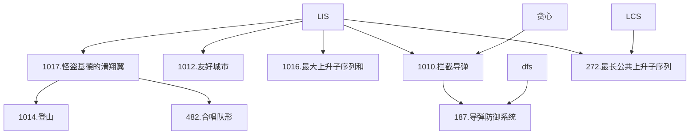

### 最长上升子序列模型（LIS）

---

**本章结构**：

**一、怪盗基德的滑翔翼**
- 问题：[Acwing 1017.怪盗基德的滑翔翼](https://www.acwing.com/problem/content/1019/)
- 分析：分别求 $1 \sim i$，$n \sim i$ 的 LIS 即可。

**二、登山**
- 问题：[Acwing 1014.登山](https://www.acwing.com/problem/content/1016/)
- 分析：编号递增 $\Leftrightarrow$ 子序列，一旦开始下降不可上升 $\Leftrightarrow$ 单峰，分别求 $1 \sim i$ 的 LIS  $f[i]$ ，$n \sim i$ 的 LIS $g[i]$ ，$ans=\max(f[i]+g[i])$。

**三、合唱队形**
- 问题：[482.合唱队形](https://www.acwing.com/problem/content/484/)
- 分析：分析题目条件，同上题，输出 $ans-n$ 即可。

**四、友好城市**
- 问题：[1012.友好城市](https://www.acwing.com/problem/content/1014/)
- 分析：

<!--stackedit_data:
eyJoaXN0b3J5IjpbLTExODc4Njg2MDYsLTE5MTMwMjU3MCwtMT
UyMDQ5MjkzMCwtMTUzMTQwOTc2NCwtOTQ1MTA5NzcxLC0xNjc3
NTkyNjkyLC0xNTg5ODg1ODM1XX0=
-->