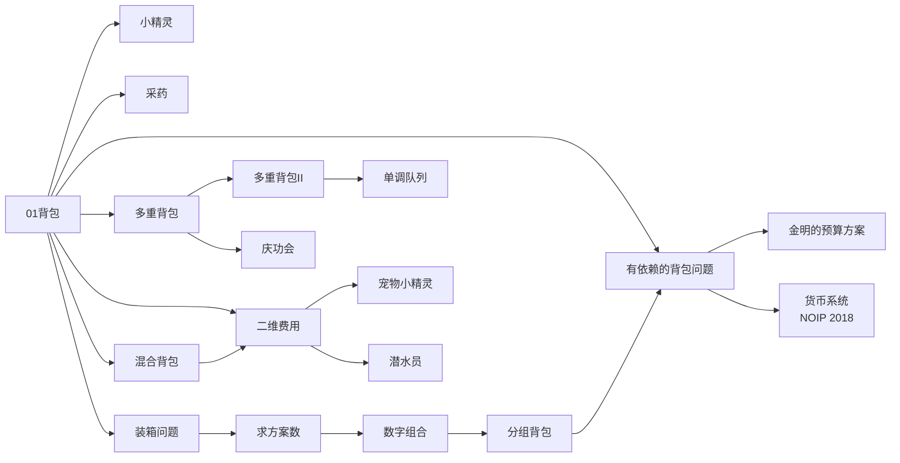

### 背包模型

---
**本章结构**：

```mermaid
graph LR
    A[01背包]
    B[小精灵]
    C[采药]
    D[装箱问题]
    E[求方案数]
    F[数字组合]
    G[分组背包]
    H[多重背包]
    I[多重背包II]
    J[单调队列]
    K[庆功会]
    L[混合背包]
    M[二维费用]
    N[宠物小精灵]
    O[潜水员]
    P[有依赖的背包问题]
    Q[金明的预算方案]
    R[货币系统<br/>NOIP 2018]

    A --> B
    A --> C
    A --> D
    A --> H
    A --> L
    A --> M
    A --> P

    D --> E
    E --> F
    F --> G
    G --> P

    H --> I
    H --> K
    I --> J

    L --> M
    M --> N
    M --> O

    P --> Q
    P --> R
```

**概念**：关于基础区间DP问题，详见[6.3 区间 DP](https://cuberxl.github.io/Coders-Note/6-动态规划/6.1-背包DP) 。

<!--stackedit_data:
eyJoaXN0b3J5IjpbLTUxODYzMDYzNF19
-->